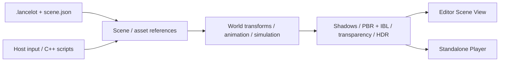

# Lancelot Engine · OpenGL-Practice

[简体中文](README.md) | [English](README.en.md)

An educational **C++20 / OpenGL 3.3** real-time rendering engine with a dockable editor.
Originally a triangle exercise, the project now includes PBR / IBL, shadows, HDR post-processing,
multiple model formats, skeletal animation, particles, fluid experiments, and standalone project data.

This is an **interactive learning prototype**, not a replacement for Unity or Unreal Engine.
Recognizing a file extension does not guarantee full support for every feature in that format.

## Screenshots

### Editor and 3D water experiment


The selected water object has editable transforms and simulation/material settings.
Panels can be moved and docked. FPS, particle counts, and timing values are snapshots
from one run, not performance benchmarks.

### PBR material comparison

| Metallic / smooth | Dielectric / rough |
| --- | --- |
|  |  |
| Metallic = 1.000; Roughness = 0.050. More distinct environment reflections. | Metallic = 0.000; Roughness = 1.000. Broader highlights and less distinct reflection detail. |

Both material parameters change between these images, so this is not an isolated one-variable test.
“Dielectric” here means a nonmetallic surface, not transparent glass.

### Editable particle emitter


This image shows the **CPU particle Smoke preset**, not the 2D fluid solver or volumetric smoke.
Emitters support transforms, emission rate, lifetime, velocity, gravity, and size controls.

See [screenshot notes and reproduction steps](docs/SCREENSHOTS.md) (Chinese)
for more detail and the retained Unreal reference images.

## Features and limits

| Module | Implemented | Important limits |
| --- | --- | --- |
| Rendering | Cook–Torrance PBR, GGX / Smith / Schlick, IBL, normal mapping, shadows, HDR / Bloom, exposure and Gamma | Lighting/shadow coverage differs between model paths; no complete anti-aliasing or ray-tracing pipeline |
| Model assets | OBJ, glTF / GLB; Assimp import for FBX, DAE, 3DS, PLY, STL, OFF, X, DXF, LWO/LWS | Additional formats primarily import static geometry and basic color materials; FBX skeletal animation does not play |
| Animation | glTF skinning, multiple clips, playback controls and clip-transition blending | Skinned path supports one skinned Primitive; no complete multi-Skin, Morph Target, or material-extension support |
| Editor | Picking, Q/W/E gizmos, local/world axes, snapping, hierarchy, subtree duplication/deletion, 64-step undo/redo | Shallow inheritance and composed settings, not an arbitrary-component ECS or editor plugin system |
| Projects | Independent `.lancelot` files, native file/folder dialogs, Chinese project paths, scene saving and `.bak` backups | External assets are not automatically copied; no automatic packaging or dynamic project script modules |
| Runtime | Play / Pause / Resume / Step / Stop, C++ character control, standalone Player | Scripts are statically compiled/registered; no hot reload, character collision, or navigation |
| Particles | CPU billboards, sorting and soft intersections; GPU Transform Feedback ping-pong and instanced rendering | GPU particles use unsorted additive blending; CPU sorting is not globally per-particle across emitters |
| Fluids | 192×192 2D smoke fields; simplified 3D SPH, surface extraction, screen-space refraction and environment reflection | Water is limited to 256 particles; no arbitrary-mesh collision, GPU SPH, or volumetric fire/smoke |
| Media | Image previews; audio/video playback, seeking, volume and a separate video window | Windows codec-dependent; no spatial audio or video-material components |

## Build and run

Requirements: Windows, Visual Studio C++ desktop tools (MSVC, Windows SDK, CMake / Ninja),
Python 3 with Jinja2 for the GLAD generator, and a graphics driver supporting OpenGL 3.3.
If Jinja2 is missing, install it with `python -m pip install Jinja2` first.
Initial configuration needs network access for dependencies and optional sample assets.
CMake FetchContent manages dependencies; there is no need to copy libraries manually.

From the repository root in **Visual Studio Developer PowerShell**:

```powershell
cmake -S . -B build -G Ninja -DCMAKE_BUILD_TYPE=Debug
cmake --build build
.\build\OpenGLPractice.exe
```

Alternatively, open the repository as a CMake project in Visual Studio and select `OpenGLPractice`.
These commands use single-configuration Ninja. With a Visual Studio multi-configuration generator,
build with `--config Debug`; executables are normally under `build/Debug/`.
Do not reuse a configured build directory with a different generator.

The editor opens `projects/Sandbox/Sandbox.lancelot` by default.
Pass another project file explicitly:

```powershell
.\build\OpenGLPractice.exe "D:\MyProject\MyProject.lancelot"
.\build\LancelotPlayer.exe "D:\MyProject\MyProject.lancelot"
```

### Create, open, and save projects

1. **File → New Project...**: enter a name, choose the parent folder, then select **Create and open**.
2. A new subfolder contains `ProjectName.lancelot`, `scene.json`, and `assets/`.
   Its initial scene has a platform, point light, camera, and environment, with no character script assigned.
3. **File → Open Project...**: select a `.lancelot` file using the Windows file dialog.
4. **Ctrl+S** saves scene data and asset references. Unsaved changes offer Save, Discard, or Cancel on switching.

Existing same-name folders are never overwritten. Stop runtime playback before creating, opening,
or saving a project. Cancelling the switch after creating a project leaves its newly created files intact.
Projects may live outside the repository, but still require the engine executable and its copied `shaders/`.

## Controls

| Input | Action |
| --- | --- |
| Click object / Hierarchy | Select a scene instance |
| Q / W / E | Move / rotate / scale; this is not Unity's default key mapping |
| F; right-drag + WASD | Focus selection; navigate the editor camera |
| Ctrl+D; Delete | Duplicate / delete the selected subtree, without deleting source assets |
| Ctrl+Z; Ctrl+Y or Ctrl+Shift+Z | Undo / redo authoring data |
| Ctrl+S | Save scene and asset references |
| Play → click Scene View → WASD | Control an object assigned a compiled script and marked as the main character |
| Pause / Resume / Step / Stop | Pause / resume / advance 1/60 second / discard the runtime copy |
| Esc | Exit in edit mode; pause in editor runtime; toggle pause/resume in standalone Player |
| Hold F1 / F2; F3 | Shadow-depth / grayscale preview; toggle Bloom |
| F4 | Toggle editor mouse mode / full-window free camera |
| ↑/↓; Z/X; C/V | Global exposure; model metallic; roughness, subject to focus/runtime restrictions |

Use Inspector for per-object material overrides; global shortcuts do not edit the selected object's override values.
Text input and camera navigation are routed separately from object-editing shortcuts.
The **语言 / Language** menu switches between Chinese and English, with the choice remembered.
The UI uses a warm theme and 20px Microsoft YaHei, with a fallback when the font is unavailable.

## Architecture

```text
OpenGL-Practice/
├─ include/ + src/       Engine API, assets, scene, simulation, rendering
├─ editor/               Editor host, panels, input routing, icons, native dialogs
├─ runtime/              LancelotPlayer without ImGui
├─ projects/             Project data and statically compiled sample C++ scripts
├─ shaders/              GLSL
├─ assets/               Sample assets and earlier reference images
├─ tests/                Projects, scenes, assets, media, runtime, real GL checks
└─ docs/                 Topic guides and images/ screenshots
```



`LancelotEngine` has no ImGui / ImGuizmo dependency; `LancelotEditor` depends on the engine.
`LancelotProjectScripts` is compiled separately. Renderer submits draws; the update phase advances simulation.

To build only the engine and Player:

```powershell
cmake -S . -B build-engine -G Ninja -DCMAKE_BUILD_TYPE=Debug -DLANCELOT_BUILD_EDITOR=OFF -DLANCELOT_FETCH_SAMPLE_ASSETS=OFF
cmake --build build-engine
```

Disabling sample downloads does not disable dependency downloads. Use Minimal or a new project
when Sandbox assets are missing. The old `src/main.cpp` is historical exercise code, not the editor entry point.

## Tests and documentation

```powershell
ctest --test-dir build --output-on-failure
```

As of **2026-09-30**, the latest complete Debug validation passed **11 tests**,
including Unicode project creation/save/reopen and real OpenGL rendering.
The engine-only configuration currently defines six tests; this documentation update does not
claim fresh validation of every configuration or generator.
Screenshots demonstrate features, not universal asset/codec compatibility or benchmark results.

The following detailed guides are currently in Chinese:

| Document | Contents |
| --- | --- |
| [Project guide](docs/PROJECT_GUIDE.md) | Rendering pipeline, transforms, assets, simulation and learning order |
| [Editor workflow](docs/EDITOR_WORKFLOW.md) | Panels, import, hierarchy, history and controls |
| [Engine and projects](docs/ENGINE_PROJECTS.md) | Native dialogs, project format, object types and persistence |
| [Play mode](docs/PLAY_MODE.md) | Runtime lifecycle, main character and compiled C++ scripts |
| [Asset formats](docs/ASSET_FORMATS.md) | Supported formats, importer limits and system codecs |
| [Architecture](docs/ARCHITECTURE.md) | Engine/editor boundaries and update/render responsibilities |
| [Screenshot notes](docs/SCREENSHOTS.md) | New screenshots, PBR reproduction, particles and Unreal references |
| [Sample asset sources](assets/README.md) | HDR, texture and glTF sources (English) |

## Next steps

Priorities are better asset diagnostics and more unified glTF skinning/material paths,
consistent lighting and shadows, resource reload and packaging, then improved transparency,
GPU fluids and volumetric effects. Current reflections, particles and water remain teaching-oriented prototypes.
