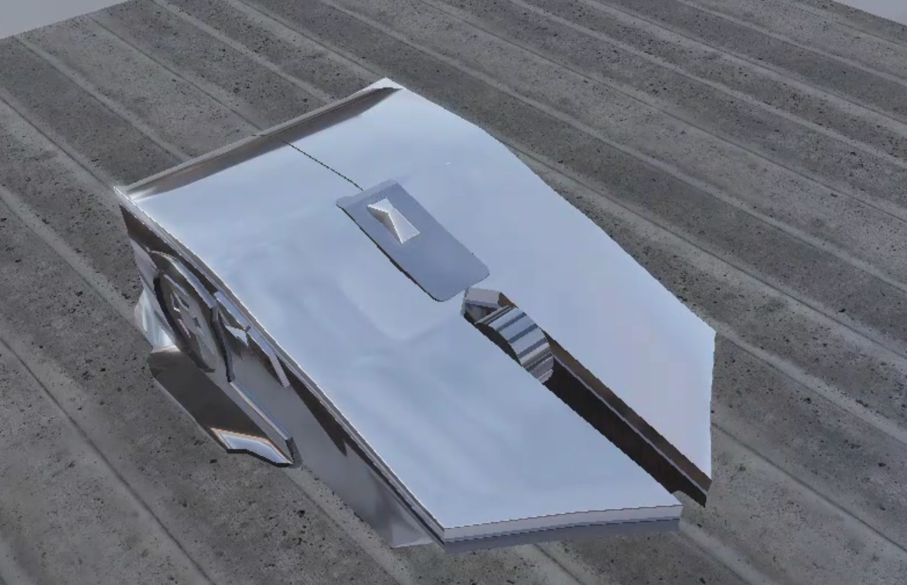
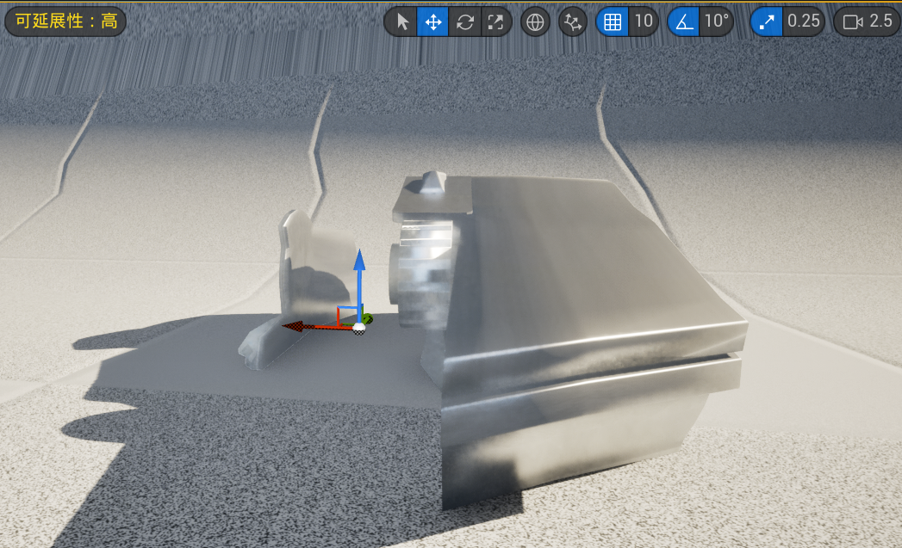

# OpenGL-Practice

一个使用 C++、OpenGL 3.3、GLFW、GLAD 和 GLM 的实时渲染练习项目。

当前项目已经从“绘制一个三角形”逐步扩展到带 PBR、IBL、阴影、HDR 后处理、glTF 骨骼动画和基础性能优化的小型实时渲染器。

完整说明请参阅：[项目完整文档](docs/PROJECT_GUIDE.md)

## 多格式模型与媒体资源

资源浏览器支持按模型、图片、音频、视频筛选。统一“导入 / 预览”入口支持
FBX、DAE、3DS、PLY、STL、OFF、X、DXF、LWO/LWS 静态模型，以及原有 OBJ/glTF/GLB。
支持模型拾取、材质分段、外部与内嵌颜色贴图、复制和场景资源引用保存。
图片可在“资源预览”中查看；音视频提供播放、暂停、停止、音量和进度控制，视频使用独立预览窗口。
音视频编码由 Windows 系统解码器支持，FBX 动画暂显示静态姿态。
格式清单、使用方法和限制见：[模型与媒体资源支持](docs/ASSET_FORMATS.md)。

## 编辑器外观与语言

界面采用象牙白背景、深棕文字和琥珀橙强调色，选中项、按钮和标签页使用暖色高亮。
继续使用 20px 微软雅黑。顶部 **语言 / Language** 可切换 **简体中文 / English**，
默认中文，下次启动会记住选择。菜单、属性、资源浏览器、日志提示、性能及粒子/流体控制已接入翻译。
对象名称、文件名和导入器原始诊断不改变；切换语言不修改场景，也不重置窗口停靠。
用户偏好存于 `%LOCALAPPDATA%/OpenGLPractice/editor_preferences.ini`。
新版布局存于 `editor_layout_v2.ini`，旧版布局文件保留，首次启动会建立新版默认布局。

## 架构整理第二、三、四阶段

已接入独立模型引用/缓存、数据组件、模拟与绘制分离、父子层级、64 步撤销/重做、
稳定 ID 保存与暂停单步，并新增无 ImGui 的 LancelotPlayer。
资源可拖入 Scene View 或 Inspector；Ctrl+Z 撤销，Ctrl+Y 重做，Pause 后 Step 单步。
这不是完整 ECS、脚本热重载或生产级资源管线。
详见：[新版操作说明](docs/EDITOR_WORKFLOW.md) 与 [架构边界](docs/ARCHITECTURE.md)。

## 对象编辑与独立项目

顶部 **文件 → 打开项目…** 使用 Windows 文件选择窗口，选择 `.lancelot` 文件即可切换。
**文件 → 新建项目…** 可填写项目名称并通过系统窗口选择父目录；自动创建同名文件夹，
内含项目文件、`scene.json` 和 `assets/`，初始场景包含平台、点光源、相机和环境。
支持中文名称和目录；已有同名文件夹不会被覆盖。切换时有未保存修改会提示保存、放弃或取消；
运行模式下需先停止才能打开或创建项目。创建后取消切换不会删除已生成的新项目。

### 运行与角色脚本

顶部 `Play / Pause / Resume / Stop` 提供独立运行场景。Sandbox 的 `Player`
已绑定项目 C++ 脚本：Play 后点击 Scene View，再用 WASD 移动；Esc 暂停，Stop
恢复编辑场景和相机。Inspector 可选择 Behaviour、主角、移动速度和相机偏移。
暂停同时冻结动画、粒子和流体，但继续渲染与响应 UI；Step 可单次推进。
脚本修改后需要重新编译，尚无角色碰撞和热重载。
详见：[运行模式与 C++ 脚本](docs/PLAY_MODE.md)。

引擎编译为 `LancelotEngine`，编辑器独立编译为 `LancelotEditor`；入口为 `editor/src/EditorMain.cpp`。
引擎不再依赖 ImGui/ImGuizmo，支持 `-DLANCELOT_BUILD_EDITOR=OFF` 独立构建。
本轮完成面板、输入采样/分发与宿主主循环拆分，详见：[架构与后续边界](docs/ARCHITECTURE.md)。
示例场景与资源引用位于 `projects/Sandbox`，不再由主循环硬编码创建。
通过 `File → Open Project...` 输入 `.lancelot` 文件路径打开项目；`Ctrl+S`
保存场景对象及资源引用，并生成 `.bak` 备份。也可把项目路径作为启动参数。

模型、CPU/GPU 粒子、水、烟雾、平台、点光源、聚光灯、相机和环境都已纳入
`Hierarchy`，可以添加、复制、删除、改名和编辑。水与烟雾实例具有独立参数与模拟状态；
`Q/W/E` 分别控制移动、旋转、缩放，专用模拟面板编辑当前实例。
所有 ImGui 面板统一使用 20px 微软雅黑（系统缺少该字体时回退默认字体）。

项目格式、继承结构与实际限制见：[引擎与项目使用说明](docs/ENGINE_PROJECTS.md)。
`projects/Minimal` 是不依赖 Sandbox 模型资源的最小项目，可用来验证项目切换。

## 效果对比与项目定位

下面两张图是虚幻编辑器中的参考效果，用来对比“最终资产效果”和本项目的学习目标。

### 虚幻参考：高质量材质与环境效果



### 虚幻参考：编辑器中的实时预览



虚幻的画面更漂亮，主要来自高质量模型、HDR 环境、Albedo、Normal、Roughness、AO
等完整资产，以及更复杂的抗锯齿、阴影和后处理流程。它更接近“使用成熟引擎制作最终画面”。

本项目的目标不同：它优先保证渲染链路透明、可调试、可独立运行。即使不依赖复杂纹理，
也可以通过材质参数观察 PBR 效果：

| 操作 | 调整参数 | 观察效果 |
| --- | --- | --- |
| `Z / X` | Metallic 金属度 | 漫反射与镜面反射的比例变化 |
| `C / V` | Roughness 粗糙度 | 高光锐利程度和环境反射模糊程度 |
| `↑ / ↓` | Exposure 曝光 | HDR 场景整体亮度变化 |
| `F3` | Bloom | 开关亮区提取与高斯模糊 |

两者的定位可以概括为：

```text
虚幻引擎：资产驱动、效果优先、适合快速获得高质量画面
本项目：渲染器驱动、过程透明、适合学习和验证 GPU 渲染原理
```

因此当前画面与虚幻存在差距，并不说明 PBR 框架不完整。主要差距来自模型复杂度、
材质资产质量、阴影分辨率和抗锯齿质量；现有项目已经具备继续提升画质所需的渲染基础。

## 当前进度

- GLFW 创建窗口和 OpenGL 3.3 Core Context
- GLAD 加载 OpenGL 函数
- VAO、VBO、EBO、索引绘制和顶点属性布局
- 顶点/片段着色器编译与链接错误检查
- 纹理坐标和 PNG 纹理加载
- GLM 的 Model / View / Projection 变换
- 深度测试和立方体渲染
- 第一人称摄像机：鼠标视角、W/A/S/D 移动、ESC 退出
- 窗口缩放时自动更新 framebuffer 视口和透视比例
- Cook–Torrance PBR：GGX、Smith、Schlick Fresnel
- PBR 材质参数：Albedo、Metallic、Roughness、AO、Normal
- 两个彩色点光源及距离衰减
- 跟随摄像机的聚光灯
- 聚光灯二维阴影贴图
- 点光源立方体阴影贴图
- `F1` 阴影深度图调试视图
- 模型加载阶段生成顶点切线和 handedness，使用稳定的 TBN 法线贴图
- `stb_image` 加载 PNG/JPG 等图像
- `tinyobjloader` 加载 OBJ 模型
- OBJ/MTL 材质颜色和 `map_Kd` 材质纹理
- GPU Instancing：实例矩阵缓冲区和实例化索引绘制
- 离屏 Framebuffer、全屏后处理和 `F2` 灰度效果
- `RGBA16F` HDR、曝光 Tone Mapping、Gamma 校正和 Bloom
- 亮区提取与双缓冲 Ping-Pong 高斯模糊
- HDR 环境 Cubemap、天空盒和程序化回退环境
- Irradiance Map、Prefilter Map、BRDF LUT 与 split-sum IBL
- Poly Haven CC0 `.hdr` 环境加载与等距柱状图转 Cubemap
- 真实 Albedo、Normal、Roughness、AO PBR 贴图组和缺失资源回退
- 父节点/子节点场景层级变换
- tinygltf 加载 glTF 2.0 网格、Skin、逆绑定矩阵和动画通道
- CPU 动画采样与节点层级更新、GPU 骨骼蒙皮（Skinning）
- 静态 glTF/.glb 场景：多节点、多三角形 Primitive、PBR 材质与贴图、透明材质
- 多动画片段选择、暂停/速度控制、LINEAR/STEP/CUBICSPLINE 采样和切换渐变
- CPU 粒子发射/运动/生命周期，实例化 Billboard、透明排序与软粒子交界
- OpenGL 3.3 Transform Feedback 双缓冲 GPU 粒子更新与实例化绘制
- 2D Stable-Fluids 风格烟雾实验窗：速度/密度平流、散度、Jacobi 压力、梯度扣除与障碍
- 教学型三维 SPH 水体：固定步进、压力/黏性/重力、边界碰撞与连续表面提取
- 基于包围球的视锥剔除，屏幕外实例不会提交给正常绘制
- 共享纹理缓存，同一路径的图片只创建一份 GPU 纹理
- Dear ImGui docking 编辑器：场景视图、层级、属性、资源、输出、性能和实验面板

## 第二、三阶段：资产与粒子

编辑器启动后即可用鼠标操作。独立的 `Resource Browser` 窗口可以逐级浏览资源文件夹、筛选文件，并选择或输入 `.gltf` / `.glb` 路径后点击加载；`Hierarchy` 选择模型实例或系统，`Inspector` 调整变换、显示、动画和材质参数。程序默认加载 Khronos 的 `BoxTextured.glb` 作为材质示例；相对路径会从项目/可执行文件周围查找，也接受绝对路径。每个 Primitive 保留自己的材质，支持 Base Color、Metallic/Roughness（G/B 通道）、Normal、Occlusion、Emissive，以及 OPAQUE/MASK/BLEND 和双面材质。当前静态场景与蒙皮动画是两条独立路径：复杂 glTF 的蒙皮、Morph Target、扩展压缩纹理及完整材质扩展尚不支持。

`Particles` 区域有 Sparks、Smoke、Snow 三种预设，可实时调整发射率、寿命、速度、重力和起止大小。粒子在 CPU 上更新，按摄像机距离从远到近排序，一次实例化调用绘制面向摄像机的面片；透明渲染保留深度测试但关闭深度写入。软粒子使用不参与写入的深度副本淡化与实体几何的交界。面板显示实时存活数，上限为 4096。此阶段是可观察、可调的基础粒子系统，不包含流体模拟/表面重建，也不是 GPU 计算粒子。

## 第四阶段：GPU 粒子

`GPU particles` 面板可控制显示、暂停、发射、重置、粒子槽位数量、发射率、寿命、重力和大小。粒子位置、速度、年龄等状态存在两份 GPU Buffer 中：一个作为 Transform Feedback 输入，另一个接收更新着色器输出，下一帧交换角色；显示使用实例化 Billboard。默认 8192 槽位，最多 32768。这个系统与前面的 CPU 粒子系统并存，便于对照两条数据路径；为省去 GPU 粒子排序，GPU 特效使用加法混合，而不是宣称已经解决大量透明粒子的正确 Alpha 合成。OpenGL 3.3 不要求 Compute Shader。

## 第五阶段：2D 烟雾流体

底部可停靠的 `2D Smoke Lab` 直接显示密度图。左键拖动注入烟雾和速度，右键拖动涂抹障碍；可开关自动烟源、暂停/重置，并调节笔刷、速度力、密度源、衰减和压力迭代次数。`Field` 可切到 Velocity、Pressure、Divergence、Obstacles，检查每个中间量。模拟数据驻留在 192×192 的速度、密度、压力、散度和障碍纹理中，每一步经离屏 Framebuffer 执行：

```text
速度/密度平流 → 注入 → 散度 → Jacobi 压力求解 → 减去压力梯度 → 显示密度
```

这是参考 [GPU Gems 的二维流体方案](https://developer.nvidia.com/gpugems/gpugems/part-vi-beyond-triangles/chapter-38-fast-fluid-dynamics-simulation-gpu)的可交互教学实现，不是完整不可压 Navier–Stokes 求解器。关闭实验页后可从 `Window` 菜单重新打开；关闭 `Simulate` 才会停止二维场更新。

## 第六阶段：三维 SPH 水体与水面材质

从顶部 `Window` 菜单打开 `3D Water Lab`，也可在 `Hierarchy` 选择 `3D Water` 后从 `Inspector` 打开。实验窗可显示/暂停水体、聚焦摄像机、重置初始水块、单步推进、施加 Splash 冲量和持续倒水；`Geometry` 可在连续水面、原始粒子点、线框之间切换。面板同时显示粒子数、网格三角形数、模拟和重建耗时。默认 125 个水粒子，最多 256 个。水体默认隐藏；打开 `Show water` 后才运行这部分 CPU 模拟。若同时开启 2D 烟雾使 Debug 帧率下降，可在同一窗口关闭 `Simulate 2D smoke`，并用 `Surface rebuilds / second` 降低网格更新频率。

每个固定时间步先由附近粒子计算密度和压力，再求压力、黏性、重力与容器边界响应。水面不是把粒子贴图叠起来：程序把粒子核函数写入三维标量场，使用 marching tetrahedra 提取连续三角网格，并把表面法线送到水材质着色器。粒子模式与线框模式用于核对“模拟点 → 密度场 → 可见水面”的关系。核心 SPH 思路参考 [Müller 等人的原始论文](https://diglib.eg.org/items/fb9edf26-94b0-4302-8cfc-52632841cae7)，但这里是为学习和交互调参简化的实现。

水面材质在绘制前复制不透明场景的 HDR 颜色与深度：沿法线偏移屏幕采样产生近似折射，深度差控制吸收与浅水边缘，环境 Cubemap 提供视角相关的 Fresnel 反射。`Shading` 可单独查看折射、Fresnel 权重和法线；折射量、吸收、反射、粗糙度、泡沫和不透明度均可调。这是屏幕空间近似，不是光线追踪折射或完整物理水体；屏幕外物体不能被折射显示，也没有真实表面张力、复杂障碍碰撞、三维体积流体或 GPU SPH 求解。

## 项目结构

```text
OpenGL-Practice/
├─ assets/
│  ├─ cube.obj              # OBJ 模型
│  ├─ cube.mtl              # OBJ 材质
│  ├─ sunset_*.hdr          # CC0 HDR 环境
│  ├─ concrete_*            # CC0 PBR 贴图组
│  ├─ comparison-*.png      # 虚幻参考效果对比图
│  └─ SimpleSkin.gltf       # CC0 glTF 骨骼动画示例
│  └─ BoxTextured.glb       # Khronos 纹理材质示例
├─ src/
│  ├─ EngineApplication.cpp # 引擎会话与资源生命周期
│  ├─ Project.cpp           # 项目与场景读写
│  ├─ ShaderProgram.cpp     # Shader 编译、链接和 uniform 查询
│  ├─ Camera.cpp            # 第一人称摄像机输入和 View 矩阵
│  ├─ Input.cpp             # 平台输入采样
│  ├─ AssetLibrary.cpp      # 多模型导入与缓存
│  ├─ SimulationRuntime.cpp # 模拟与动画更新
│  ├─ RuntimeSession.cpp    # 脚本与运行生命周期
│  ├─ Mesh.cpp              # VAO/VBO/EBO、实例缓冲区和绘制
│  ├─ Model.cpp             # OBJ/MTL 解析、索引去重和切线生成
│  ├─ Material.cpp          # MTL 漫反射纹理的加载、持有和查找
│  ├─ RenderTarget.cpp      # 场景颜色纹理和深度/模板缓冲
│  ├─ BlurBuffer.cpp        # Bloom 的双 HDR 模糊缓冲区
│  ├─ EnvironmentIBL.cpp    # 环境贴图与 IBL 预计算资源
│  ├─ GltfAnimatedModel.cpp # glTF、动画采样和 GPU Skinning
│  ├─ GltfScene.cpp         # 静态 glTF 场景和 PBR 材质
│  ├─ ParticleSystem.cpp    # CPU 发射/更新与实例化绘制
│  ├─ GpuParticleSystem.cpp # Transform Feedback 粒子更新
│  ├─ Fluid2D.cpp           # 2D 烟雾纹理与多 Pass 求解
│  ├─ FluidSystem.cpp       # SPH 更新、密度场与水面网格提取
│  ├─ Frustum.cpp           # 视锥平面与包围球测试
│  ├─ TextureCache.cpp      # 共享文件纹理资源
│  ├─ Scene.cpp             # 场景节点、世界矩阵和动态光源
│  ├─ Renderer.cpp          # 阴影与正常场景的多遍渲染
│  ├─ ShadowMap.cpp         # 二维/立方体深度纹理与 framebuffer
│  ├─ Texture2D.cpp         # 2D 纹理加载和绑定
│  ├─ AssetPaths.cpp        # 跨工作目录查找 assets
│  ├─ Window.cpp            # GLFW 窗口、Context 和 GLAD 初始化
│  └─ main.cpp              # 早期三角形练习代码
├─ editor/
│  ├─ include/              # 编辑器接口与面板状态
│  └─ src/                  # EditorMain/Application/Workspace、独立面板与 PlaySession
├─ runtime/                 # 独立 Player 宿主
├─ projects/                # 项目描述、场景数据与项目脚本
├─ include/
│  ├─ ShaderProgram.h
│  ├─ Camera.h
│  ├─ Mesh.h
│  ├─ Texture2D.h
│  └─ AssetPaths.h
├─ shaders/
│  ├─ main.vert / main.frag                 # 正常材质和光照
│  ├─ depth.vert / depth.frag               # 阴影深度 Pass
│  ├─ light_marker.vert / light_marker.frag # 光源标记
│  ├─ debug.vert / debug.frag               # 深度图调试视图
│  ├─ postprocess.vert / postprocess.frag   # HDR 合成和 Tone Mapping
│  ├─ bright_pass.frag                       # HDR 亮区提取
│  ├─ blur.frag                              # 可分离高斯模糊
│  ├─ cubemap_capture.vert                   # 环境 Cubemap 捕获
│  ├─ procedural_environment.frag            # 程序化 HDR 天空
│  ├─ irradiance_convolution.frag            # 漫反射 IBL 卷积
│  ├─ prefilter_environment.frag             # 粗糙度预过滤
│  ├─ brdf_lut.vert / brdf_lut.frag          # BRDF 积分查找表
│  ├─ skybox.vert / skybox.frag              # 天空盒显示
│  └─ skinned.vert / skinned.frag            # 骨骼蒙皮示例
├─ CMakeLists.txt
└─ README.md
```

`editor/src/EditorMain.cpp` 打开项目，`EditorApplication.cpp` 组织宿主主循环；`EngineApplication.cpp` 只负责引擎会话和资源，不创建编辑器 UI。原来的 `main.cpp` 保留作为早期练习记录，CMake 不会编译它。

## 模块职责

```text
EditorMain.cpp   → 打开项目并启动编辑器宿主
Project.cpp      → 读取资源引用、保存和加载场景
EngineApplication.cpp → 资源初始化、会话生命周期与渲染入口
EditorApplication.cpp → 主循环与编辑/运行流程
InputSystem / EditorInputRouter → 平台采样与宿主输入分流
ShaderProgram    → 从 shaders/ 读取 GLSL、编译/链接并查询 uniform
Camera           → 接收移动轴/指针坐标，生成 View 矩阵
EditorWorkspace  → Docking、Scene View 与独立面板组合
Mesh             → 管理几何/实例缓冲区并发起普通或实例化绘制
Model            → 解析 OBJ/MTL，生成索引顶点、切线和材质分段
MaterialLibrary  → 加载并管理 MTL 引用的漫反射纹理
PbrMaterial      → 加载和绑定 Albedo/Normal/Roughness/AO 贴图组
TextureCache     → 去重并统一持有文件纹理的 GPU 对象
GltfAnimatedModel→ 读取 glTF Skin/动画并执行 GPU 顶点蒙皮
Frustum          → 从 ViewProjection 提取平面并剔除屏幕外包围球
RenderTarget     → 管理可随窗口尺寸变化的离屏场景 framebuffer
BlurBuffer       → 管理 Bloom 使用的两个 Ping-Pong 浮点纹理
EnvironmentIBL   → 生成环境、Irradiance、Prefilter 和 BRDF LUT
Scene            → 更新节点层级、世界矩阵和动态光源
Renderer         → 执行阴影、正常场景、光源标记和调试 Pass
ShadowMap        → 管理二维和立方体阴影贴图的 GPU 资源
Texture2D        → 加载图片、创建纹理、绑定纹理单元
AssetPaths       → 兼容 Visual Studio 和命令行工作目录的资源查找
Window           → 创建 GLFW 窗口、OpenGL Context 和 GLAD 函数加载器
```

## 环境要求

- Windows
- Visual Studio，包含 MSVC、Windows SDK 和 CMake 工具
- 支持 OpenGL 3.3 的显卡驱动
- 首次配置需要网络，用于获取依赖和 Poly Haven CC0 示例资产

## 构建和运行

在 Visual Studio Developer Command Prompt 中执行：

```powershell
cmake -S . -B build
cmake --build build --config Debug
.\build\Debug\OpenGLPractice.exe
```

也可以直接使用 Visual Studio 打开 CMake 项目，构建并运行 `OpenGLPractice`。

## 操作方式

- 左键点击场景模型或 `Hierarchy > Scene Objects`：选中实例；点击场景空白：取消选择
- `Q`：移动工具；拖动红 / 绿 / 蓝轴分别沿 X / Y / Z 移动
- `W`：旋转工具；拖动对应轴的旋转环
- `E`：缩放工具；拖动对应轴进行单轴缩放（局部轴），中心手柄统一缩放
- `Inspector`：名称、可见性、位置、角度、缩放；可切换局部轴与吸附步长
- `Ctrl+D`：复制选中实例；`Delete`：移除场景实例，也可用目录按钮或右键菜单
- `F`：在场景视图内聚焦选中实例
- 场景视图中按住鼠标右键拖动：旋转摄像机；同时按 `W/A/S/D`：移动摄像机
- `ESC`：退出程序
- 按住 `F1`：显示聚光灯阴影深度图
- 按住 `F2`：对最终画面应用灰度后处理
- `F3`：开启/关闭 Bloom
- `F4`：切换编辑器鼠标模式 / 全窗口自由摄像机模式
- `↑/↓`：提高/降低 HDR 曝光值
- `Z/X`：降低/提高模型金属度
- `C/V`：降低/提高模型粗糙度

Windows 下仅在文本输入框内关联中文输入法，避免输入法截走场景 Q/W/E；这是本程序窗口的输入处理，不改变系统输入法设置。

界面布局为 `Hierarchy | Scene View | Inspector`，底部停靠 `Resource Browser / Output / Profiler / 2D Smoke Lab`。各窗口可以拖动、停靠、关闭并从 `Window` 菜单重新打开；布局保存在本机的 `OpenGLPractice/editor_layout.ini`，菜单可恢复默认布局。对象轴以归一化模型的中心为基准；移动/旋转可选世界或局部轴，单轴缩放使用局部轴，避免旋转后引入剪切。右键相机导航和文本输入期间不会触发对象快捷键。`Profiler` 显示 FPS、帧时间、Draw Call、三角形、粒子与流体统计；统计包含渲染 Pass 的重复绘制，不含编辑器自身的绘制。

实例编辑覆盖模型、粒子、水、烟雾、平台、灯光、相机和环境。静态 OBJ/glTF 与平台、烟雾平面点击选择检测三角形，蒙皮模型和水暂用包围球，不处理透明纹理的空洞。模型按路径绑定与缓存，OBJ 可覆盖材质参数，蒙皮动画按对象独立控制。层级复制/删除针对子树，不删除磁盘资产；Ctrl+S 保存，Ctrl+Z/Ctrl+Y 撤销和重做作者数据。烟雾仍是二维模拟的显示面，不是真正体积烟雾。

### 粒子发射器对象

`Hierarchy > Scene Objects` 包含 `CPU Particle Emitter` 和 `GPU Particle Emitter`。在目录选中，或点击场景中黄色 CPU / 蓝色 GPU 原点标记后，使用 Q/W/E 编辑变换。通过 `Add particle emitter` 新建，Ctrl+D 复制，Delete 删除；每个发射器有独立参数和模拟状态，复制只复制配置，不复制已经生成的粒子。Inspector 可切换预设、调整发射率/寿命/重力，并单独重置发射器。

粒子在发射器局部空间模拟，已有粒子随对象整体移动；旋转同时旋转发射方向和局部重力，缩放改变粒子分布范围。Billboard 始终朝向摄像机，粒子尺寸按对象最大轴缩放，不把单个粒子片拉成椭圆。隐藏对象会停止显示并冻结模拟；CPU 关闭 Emit 则停止生成新粒子，已有粒子继续消亡。GPU 可独立暂停或停止发射。CPU 粒子按发射器距离及各发射器内部粒子排序，不是跨发射器逐粒子的全局排序，交叉烟雾仍可能存在透明混合限制。每增加一个 GPU 发射器都会增加独立缓冲区和更新开销。

场景回归测试：构建后运行 `ctest --test-dir out/build/x64-Debug --output-on-failure`，覆盖实例编号、复制删除、隐藏、资源模板保留、射线选择和 Gizmo 矩阵分解。

## 渲染流程概览

每帧大致执行以下步骤：

```text
更新输入和摄像机
        ↓
Transform Feedback 更新 GPU 粒子；2D 烟雾执行平流/压力投影
        ↓
计算场景节点的世界矩阵
        ↓
采样 glTF 动画并计算骨骼矩阵
        ↓
视锥剔除并更新可见实例缓冲区
        ↓
聚光灯深度 pass
        ↓
点光源六面阴影 pass
        ↓
Cook–Torrance PBR 直接光照
        ↓
Irradiance + Prefilter + BRDF LUT 环境光照
        ↓
绘制 HDR 天空盒
        ↓
绘制透明 glTF Primitive
        ↓
绘制连续流体水面或调试粒子/线框
        ↓
绘制 CPU 软粒子与 GPU 实例化粒子
        ↓
绘制灯光标记和调试视图
        ↓
离屏颜色纹理经过全屏后处理
        ↓
提取亮区并执行 Ping-Pong 高斯模糊
        ↓
合成 Bloom，执行曝光 Tone Mapping 和 Gamma 校正
        ↓
交换前后缓冲区
```

## 依赖说明

- GLFW：窗口、输入和 OpenGL Context
- GLAD：加载现代 OpenGL 函数
- GLM：向量、矩阵和摄像机数学
- stb_image：图像文件加载
- tinyobjloader：OBJ 模型解析
- tinygltf：glTF 2.0、Skin 和 Animation 数据解析
- Dear ImGui docking：可停靠编辑器工作区和参数控件

依赖由 CMake `FetchContent` 管理，不需要手动复制到项目目录。
