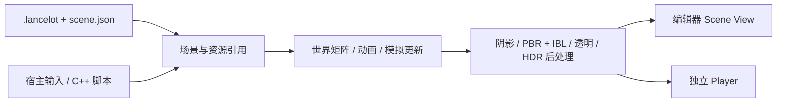

# Lancelot Engine · OpenGL-Practice

[简体中文](README.md) | [English](README.en.md)

基于 **C++20 / OpenGL 3.3** 的教学型实时渲染引擎与可停靠编辑器。
从三角形练习逐步发展到 PBR / IBL、阴影、HDR 后处理、多格式模型、
骨骼动画、粒子与流体实验，以及可保存的独立项目。

当前定位是**可交互的学习与实验原型**，不是 Unity / Unreal 的替代品。
下文区分已有功能与已知限制，不把“能识别文件扩展名”当作完整格式支持。

## 效果展示

### 编辑器与三维水体


Hierarchy、Scene View、Inspector、Resource Browser、Output、Profiler 与实验面板
可以拖动和停靠。图中选中的是可变换的水对象，右侧可实时调整模拟与水面材质。
截图中的 FPS、粒子数和耗时是该次运行的瞬时读数，不是性能基准。

### PBR 材质对比

| 金属、低粗糙度 | 非金属、高粗糙度 |
| --- | --- |
|  |  |
| Metallic = 1.000；Roughness = 0.050。环境反射较清晰。 | Metallic = 0.000；Roughness = 1.000。高光更宽，反射细节不明显。 |

两图展示同一模型通过 Inspector 的材质覆盖调整后的外观；Metallic 和 Roughness
同时改变，不能把全部差异归因于单个参数。这里的“非金属”不是透明玻璃材质。

### 可编辑粒子发射器


图中是 **CPU 粒子系统的 Smoke 预设**：发射器可移动、旋转、缩放，并调整发射率、
寿命、速度、重力和大小。它不是二维流体求解器，也不是真正的体积烟雾。

截图说明、复现步骤及原有 Unreal 参考图见：[图像展示与实验说明](docs/SCREENSHOTS.md)。

## 功能与边界

| 模块 | 当前实现 | 主要边界 |
| --- | --- | --- |
| 渲染 | Cook–Torrance PBR、GGX / Smith / Schlick、IBL、法线贴图、阴影、HDR / Bloom、曝光与 Gamma | 不同模型路径的光照/阴影支持尚未统一；不是完整抗锯齿或光线追踪管线 |
| 模型资产 | OBJ、glTF / GLB；Assimp 导入 FBX、DAE、3DS、PLY、STL、OFF、X、DXF、LWO/LWS | 新增格式以静态网格与基础颜色材质为主；FBX 骨骼动画不播放 |
| 动画 | glTF 蒙皮、多个动画片段、播放/暂停/速度、片段切换渐变 | 蒙皮路径仅支持一个蒙皮 Primitive；无完整多 Skin / Morph Target / 扩展材质支持 |
| 编辑器 | 拾取、Q/W/E Gizmo、局部/世界轴、吸附、层级、子树复制/删除、64 步撤销/重做 | 浅继承与数据组合，不是任意组件 ECS；不提供编辑器插件接口 |
| 项目 | 独立 `.lancelot`、系统打开/目录选择窗口、中文项目路径、场景保存与 `.bak` | 外部资产不会自动复制；没有自动打包或动态项目脚本模块 |
| 运行时 | Play / Pause / Resume / Step / Stop、C++ 主角控制、独立 Player | 脚本静态编译注册；无热重载、角色碰撞或导航 |
| 粒子 | CPU Billboard、排序、软交界；GPU Transform Feedback 双缓冲与实例化 | GPU 用加法混合，无透明排序；CPU 不做跨发射器逐粒子全局排序 |
| 流体 | 192×192 二维烟雾场；简化三维 SPH、连续表面提取、屏幕空间折射与环境反射 | 水体最多 256 粒子；无任意模型碰撞、GPU SPH 或体积烟火 |
| 媒体 | 图片预览；音视频播放、暂停、跳转、音量与独立视频窗口 | 音视频依赖 Windows 解码器；没有空间音源或视频材质组件 |

## 快速开始

需要 Windows、Visual Studio 的 C++ 桌面开发工具（MSVC、Windows SDK、CMake / Ninja）
以及 Python 3（GLAD 生成器需要 Jinja2）和支持 OpenGL 3.3 的显卡驱动。
若 Python 环境缺少 Jinja2，可先运行 `python -m pip install Jinja2`。首次配置需要网络获取依赖；
依赖由 CMake FetchContent 管理，不必手动复制外部库。

在仓库根目录的 **Visual Studio Developer PowerShell** 中运行：

```powershell
cmake -S . -B build -G Ninja -DCMAKE_BUILD_TYPE=Debug
cmake --build build
.\build\OpenGLPractice.exe
```

也可直接用 Visual Studio 打开仓库，选择 `OpenGLPractice` 作为启动目标。
上述命令使用单配置 Ninja；若使用 Visual Studio 多配置生成器，
构建需指定 `--config Debug`，可执行文件通常位于 `build/Debug/`。
已有构建目录应沿用原生成器，或为新生成器另选目录。

默认打开 `projects/Sandbox/Sandbox.lancelot`。也可传入项目文件：

```powershell
.\build\OpenGLPractice.exe "D:\MyProject\MyProject.lancelot"
.\build\LancelotPlayer.exe "D:\MyProject\MyProject.lancelot"
```

### 新建、打开与保存项目

1. **文件 → 新建项目…**：填写名称，通过“选择目录…”选父目录，再点击“创建并打开”。
2. 自动创建同名子目录，包含 `项目名.lancelot`、`scene.json`、`assets/`。
   基础场景包含平台、点光源、相机和环境，不自动绑定角色脚本。
3. **文件 → 打开项目…**：从 Windows 文件窗口选择 `.lancelot`。
4. **Ctrl+S** 保存场景与资产引用；切换时有未保存修改可保存、放弃或取消。

已有同名目录不会覆盖。运行时需先 Stop 才能创建、切换或保存。
新项目创建后若取消切换，已生成的项目仍保留。
项目可放在仓库外，但运行仍需要引擎程序和随构建复制的 `shaders/`。

## 常用操作

| 操作 | 功能 |
| --- | --- |
| 左键点对象 / Hierarchy | 选中场景实例 |
| Q / W / E | 移动 / 旋转 / 缩放；不是 Unity 的默认快捷键映射 |
| F；右键拖动 + WASD | 聚焦选中对象；编辑相机导航 |
| Ctrl+D；Delete | 复制 / 删除选中子树，不删除磁盘资产 |
| Ctrl+Z；Ctrl+Y 或 Ctrl+Shift+Z | 撤销 / 重做作者数据 |
| Ctrl+S | 保存场景和资源引用 |
| Play → 点击 Scene View → WASD | 控制已绑定脚本并标记为主角的对象 |
| Pause / Resume / Step / Stop | 暂停 / 继续 / 单步 1/60 秒 / 丢弃运行副本 |
| Esc | 编辑模式退出；编辑器运行模式暂停；独立 Player 暂停/恢复 |
| F1 / F2（按住）；F3 | 阴影深度 / 灰度预览；开关 Bloom |
| F4 | 编辑器鼠标模式与全窗口自由相机切换 |
| ↑/↓；Z/X；C/V | 全局曝光；模型金属度；粗糙度（受焦点和运行状态限制） |

对象材质覆盖优先在 Inspector 调整；全局快捷键不等于修改选中对象的覆盖值。
文本输入与右键导航期间，对象工具快捷键会受到输入路由限制。
顶部 **语言 / Language** 支持中文 / English，默认中文并记住选择。
界面采用暖色主题、20px 微软雅黑（缺少字体时回退），支持模块化停靠。

## 项目结构与数据流

```text
OpenGL-Practice/
├─ include/ + src/       引擎接口、资源、场景、模拟与渲染
├─ editor/               编辑器宿主、面板、输入路由、图标与系统选择窗口
├─ runtime/              无 ImGui 的 LancelotPlayer
├─ projects/             独立项目数据与静态编译的示例 C++ 脚本
├─ shaders/              GLSL
├─ assets/               示例模型、纹理、环境与原有参考图
├─ tests/                项目、场景、资源、媒体、运行与真实 GL 测试
└─ docs/                 专题文档与 images/ 截图
```



`LancelotEngine` 不依赖 ImGui / ImGuizmo；`LancelotEditor` 依赖引擎；
`LancelotProjectScripts` 独立编译。Renderer 只绘制，模拟由更新阶段推进。
只构建引擎与 Player：

```powershell
cmake -S . -B build-engine -G Ninja -DCMAKE_BUILD_TYPE=Debug -DLANCELOT_BUILD_EDITOR=OFF -DLANCELOT_FETCH_SAMPLE_ASSETS=OFF
cmake --build build-engine
```

关闭示例资产下载不会关闭依赖下载，缺少 Sandbox 资产时请使用 Minimal 或新建项目。
旧的 `src/main.cpp` 是早期练习记录，不是当前编辑器入口。

## 验证与文档

```powershell
ctest --test-dir build --output-on-failure
```

截至 **2026-09-30**，最近完整 Debug 验证为 **11 项测试通过**，
包含中文项目创建/保存/重开及真实 OpenGL 渲染验证。
纯引擎配置当前定义 6 项测试；并非本次文档更新重新验证了所有生成器与配置。
截图用于功能展示，不代表所有资产、编码或性能场景均已通过测试。

| 文档 | 内容 |
| --- | --- |
| [项目完整说明](docs/PROJECT_GUIDE.md) | 渲染链路、矩阵、资产、模拟和学习顺序 |
| [编辑器工作流](docs/EDITOR_WORKFLOW.md) | 面板、导入、层级、历史记录和操作 |
| [引擎与项目](docs/ENGINE_PROJECTS.md) | 系统目录选择、项目格式、对象结构和保存 |
| [运行模式](docs/PLAY_MODE.md) | Play / Pause / Step、主角与 C++ 脚本 |
| [模型与媒体格式](docs/ASSET_FORMATS.md) | 支持清单、导入限制和系统解码器 |
| [架构说明](docs/ARCHITECTURE.md) | 引擎 / 编辑器边界、更新与绘制职责 |
| [截图说明](docs/SCREENSHOTS.md) | 四张新截图、PBR 复现、粒子与 Unreal 参考 |
| [示例资产来源](assets/README.md) | 示例 HDR、纹理及 glTF 来源 |

## 后续方向

优先完善资产诊断与 glTF 蒙皮/材质路径，再补齐多光源与阴影一致性、
资源热重载及打包；随后考虑更可靠的透明排序、GPU 流体和体积效果。
截图中的水面、粒子与反射已经可交互，但仍应按教学原型的范围理解。
