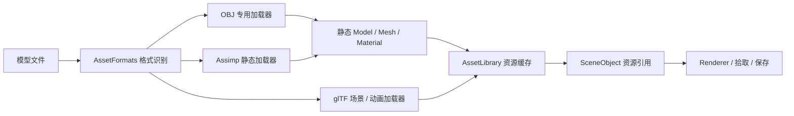

# 模型与媒体资源支持

资源浏览器的“导入 / 预览”入口按文件类型分流。扩展名不区分大小写。
模型也可双击导入，或拖入场景视图 / 属性检查器。
图片、音频和视频单击后打开“资源预览”，也可在输入框填写外部文件的绝对路径。
相对路径以当前项目的资源根目录为基准。

| 类型 | 格式 | 当前行为 |
| --- | --- | --- |
| 模型 | OBJ | 原有材质分段与纹理加载 |
| 模型 | glTF / GLB | 原有静态场景；“导入骨骼动画模型”使用动画加载器 |
| 模型 | FBX、DAE、3DS、PLY、STL、OFF、X、DXF、LWO/LWS | Assimp 静态网格导入、基础颜色材质、外部/内嵌颜色贴图、拾取、复制与场景保存 |
| 图片 | PNG、JPG/JPEG、BMP、TGA、GIF、PSD、HDR、PIC、PPM/PGM/PNM | 内置图片解码和等比例预览 |
| 音频 | WAV、MP3、WMA、AAC、M4A、FLAC | Windows Media Foundation 试听；实际编码须由系统解码器支持 |
| 视频 | MP4、M4V、MOV、AVI、WMV、ASF、MKV | Windows Media Foundation 播放；独立预览窗口，实际编码须由系统解码器支持 |

图片解码器支持的 PSD 是合成图像；GIF 显示第一帧；HDR 在图片预览中转换为普通显示颜色。
音视频按钮提供播放、暂停、停止、音量和进度。关闭预览或切换资源会释放旧媒体。
音视频预览独立于场景的 Play / Pause；目前没有空间音源组件，也没有视频材质组件。
不支持的编码会显示错误码，不把“识别到扩展名”当作成功播放。

## 模型导入的内部结构

Assimp 5.4.3 由 CMake 获取并静态链接，启用表格中的导入器。
节点变换烘焙到静态顶点中，非均匀缩放使用逆转置法线矩阵，镜像节点修正三角形绕序。
模型里的多个网格和材质分段保留为绘制批次，节点不会自动拆成可单独编辑的场景对象。
FBX 等文件中的骨骼/动画目前显示静态姿态，并在导入结果中提示；播放动画请使用 glTF/GLB。
高级 FBX 材质、动画约束、灯光和相机不转换成引擎组件。

为兼容已有场景文件，旧的 OBJ 对象类别继续作为通用静态模型类别使用。
文件格式通过 AssetFormats 和加载器处理，Renderer 复用静态模型绘制流程。
已有场景保存格式与资源引用保持可读。静态模型可跨格式重新绑定，失败时保留原引用。

## 添加新的格式

1. 为模型启用对应 Assimp 导入器，或实现专用加载器。
2. 将扩展名加入 AssetFormats 的实际支持列表。
3. 更新此支持表并加入真实文件的加载与失败测试。

媒体的容器扩展名与音视频编码是两回事：例如 MP4 内的 H.264 与 HEVC 可能有不同解码需求。
当前使用 Windows 系统解码器，后续可通过 MediaPreview 后端接入其他解码实现。

## 验证

AssetFormatsTests 生成独立的 FBX、STL、PLY、OFF 测试文件，检查节点变换、几何、缓存、
场景资源引用、格式重新绑定、导入失败隔离和实际渲染。
MediaPreviewTests 生成静音 WAV 和 H.264 MP4，检查音视频加载、时长、播放、暂停、
音频跳转、停止和释放。MP4 使用 Windows 自带编码器生成，无需外部测试媒体。
原有场景、运行模式、项目和渲染测试继续参与回归验证。

2026-09-30：独立 Debug 构建成功，完整 10 项测试全部通过；编辑器窗口中确认中文分类、
多格式导入入口和图片预览正常显示。

参考：[Assimp 官方格式列表](https://github.com/assimp/assimp/blob/v5.4.3/doc/Fileformats.md)、
[Microsoft MFPlay 文档](https://learn.microsoft.com/en-us/windows/win32/medfound/getting-started-with-mfplay)。
