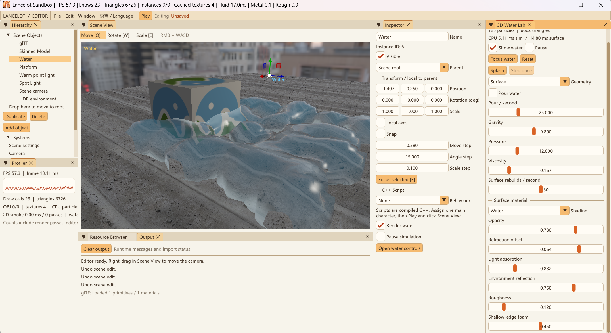

# 编辑器工作流

这是当前可操作的版本，不是完整 Unity/Unreal 功能清单。

[中文 README](../README.md) · [English README](../README.en.md) · [截图与复现](SCREENSHOTS.md)



## 项目与工作区

- 文件 → 新建项目…：输入名称，通过系统目录窗口选择父目录，创建并打开基础场景。
- 文件 → 打开项目…：从 Windows 文件窗口选择 `.lancelot`，无需手填路径。
- 已有同名目录不会覆盖；有未保存修改时可保存、放弃或取消切换。
- 运行时需先 Stop 才能创建、切换或保存项目；新建后取消切换会保留新项目文件。
- Window 菜单重开已关闭面板，Reset workspace layout 恢复默认停靠。
- 语言 / Language 切换中文或英文；布局与语言偏好保存到本机，不属于场景数据。
- 当前布局文件为 `%LOCALAPPDATA%/OpenGLPractice/editor_layout_v2.ini`。

Q / W / E 分别是移动、旋转、缩放；F 聚焦选中对象，右键拖动 + WASD 导航相机。
对象变换可在 Gizmo 和 Inspector 中编辑；单轴缩放使用局部轴，移动/旋转可切换局部/世界轴。
文本输入和右键导航期间不触发对象工具快捷键，运行时编辑工具禁用。

## 多模型资源

1. 在 Resource Browser 选择文件，或输入相对项目 assetRoot / 绝对路径。
2. 导入 / 预览（Import / Preview）按类型分流；模型创建新对象，不替换其他模型。
   支持 OBJ、glTF/GLB 与 FBX、DAE、3DS、PLY、STL、OFF、X、DXF、LWO/LWS 静态导入。
3. Import animated skin 接入当前加载器支持的蒙皮 glTF/GLB。
4. 可拖文件到 Scene View 新建对象；拖到 Inspector 的资源按钮绑定选中模型。
5. Bind selected model 只改选中对象；通用静态类别支持已启用的静态格式重新绑定，
   glTF/蒙皮类别仍使用相应 glTF/GLB 路径，失败保留原引用。
6. Ctrl+S 保存引用。资产源文件不自动复制；分发项目时请把外部资源和依赖纹理一起放好。

同一路径的 OBJ/静态 glTF 复用缓存。OBJ 材质可勾选 Override material，再独立调整
Metallic / Roughness。蒙皮对象的片段、播放开关、速度独立保存。
导入失败不替换原对象；Output/资源面板显示原因，修复文件后再次导入可重试。
已有缓存的文件不会自动热重载。

图片、音频、视频进入独立 Asset Preview；音视频依赖系统解码器，播放控制不随场景 Pause。
FBX 骨骼动画当前不播放，GIF 图片预览只显示首帧。完整范围见 [资产格式](ASSET_FORMATS.md)。
PBR 参数对比与单变量实验见 [截图说明](SCREENSHOTS.md#2-金属与非金属对比)。

## 粒子与流体对象

在层级选择发射器、水或烟雾后，Inspector 编辑对应实例的配置；多个实例状态独立。
发射器模拟采用局部空间，已有粒子随对象变换；复制创建新的模拟，不复制已经生成的粒子。
CPU Smoke 粒子、2D Smoke Lab 流体和三维 SPH 水是不同系统，详见 [项目说明](PROJECT_GUIDE.md)。
水面 Geometry 可选 Surface / Particles / Wireframe；修改透明/折射参数并不增加模型碰撞。

## 父子层级

拖对象到目录里的另一对象，或在 Inspector → Parent 选择父节点；
拖到目录底部根区域或选择 Scene root 可解除父节点。

父节点的移动、旋转、缩放、可见性传给子节点。Position/Rotation/Scale
显示局部值；场景 Gizmo 在世界空间编辑后转换回局部值。
改父节点默认保持世界变换。循环、缺失父节点以及非均匀缩放/旋转导致的
无法表示为 TRS 的剪切会被拒绝，而不是悄悄修改结果。

Ctrl+D 复制整个子树并重映射 ID；复制对象不会继承主角资格。
Delete 删除整个子树，但不删除模型源文件。

## 撤销、重做与保存

- Ctrl+Z：撤销；Ctrl+Y 或 Ctrl+Shift+Z：重做；Edit 菜单也可使用。
- 连续 Gizmo/数值拖动/文字输入，在操作结束时合成一条记录，最多 64 条。
- 增删、复制、改父节点、改名、变换、可见性、对象参数、模型绑定和脚本参数均在历史内。
- 修改后显示 Unsaved；Ctrl+S 保存对象 ID、父节点、局部 TRS 与组件/资产引用。
- 保存使用临时文件替换，并保留 .bak；每个文件单独替换，不是跨文件事务。
- 历史只在当前会话中有效，切换项目后清空；新编辑会清空重做分支。
- 相机导航、布局、全局曝光/Bloom、实时模拟点/纹理/障碍不在作者数据历史内。
- 历史恢复会重建模拟状态，不承诺恢复某一时刻的水粒子或烟雾纹理。

旧 v1 场景无需手动改写，读取时补默认字段；再次保存才写入新版字段。

## 编辑、运行和单步

编辑状态可预览模拟；Play 克隆作者场景并执行 C++ 脚本。
点击 Scene View 后 WASD 控制主角；Pause/Esc 暂停，Resume 继续。
Pause 后 Step 推进 1/60 秒并保持暂停，不提供玩家移动输入；
对象自身的局部暂停设置仍有效，水/烟雾沿用各自固定步求解器。
Stop 丢弃运行副本并还原编辑相机，运行时不允许保存/修改作者场景。

引擎每帧的责任顺序：

```text
脚本更新 → 世界矩阵 → 模拟/动画更新 → 阴影/颜色/透明/后处理 → UI 或 Player 显示
```

Renderer 不推进模拟；同一更新结果可以重复绘制。SimulationRuntime 独立管理
每个发射器、水、烟雾及蒙皮对象的运行实例。

## 独立运行

```powershell
.\out\build\x64-Debug\LancelotPlayer.exe "D:\MyProject\MyProject.lancelot"
```

WASD 控制角色，Esc 暂停/恢复，关闭窗口退出。不带参数打开 Sandbox。
纯引擎配置 LANCELOT_BUILD_EDITOR=OFF 也会生成 Player，不需要 ImGui。
脚本仍须编译到 LancelotProjectScripts；打开数据项目不动态加载任意 C++。
尚无自动打包、碰撞/导航、任意组件 ECS、脚本/资源热重载或运行状态持久快照。

## 验证覆盖

- SceneWorkflowTests：父子变换、循环/缺失父节点拒绝、子树复制/删除、
  历史分支、稳定 ID、模型组件持久化与旧格式迁移。
- RuntimeSessionTests：无编辑器运行生命周期、父节点缩放下的世界移动与单步暂停。
- AssetsRuntimeTests：隐藏的真实 GL Context，多资产共存/缓存/绑定、
  导入失败不破坏场景、实际帧缓冲有内容、重复绘制与暂停不推进模拟、独立呈现无 GL 错误。
- ProjectCreationTests：中文项目创建、同名目录/非法名称保护、保存重开与真实 GL 渲染。
- AssetFormatsTests / MediaPreviewTests：多格式模型与系统音视频加载和实际运行。
- EditorLocaleTests：语言映射与稳定界面标识；保留 SceneEditorTests、PlaySessionTests、ProjectTests、EngineBoundaryTests。

当前编辑器配置定义 11 项测试，纯引擎配置定义 6 项测试。
2026-09-30 的最近完整 Debug 验证为 11 项通过；原有 7/4 项结果属于扩展前的历史检查。
系统项目文件窗口和新建目录窗口已实际打开并验证取消返回。
桌面已验证 Play/WASD/Pause/Step/Stop、位置编辑撤销/重做及目录拖放父节点，未保存测试修改。
资源窗口已检查导入与绑定入口；资产拖放/重新绑定的完整鼠标流程仍建议继续回归，自动化 GPU 测试不替代全部 UI 验收。
