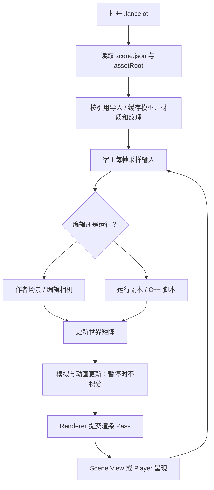
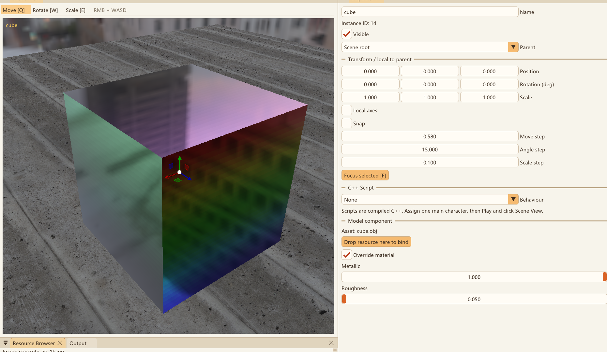
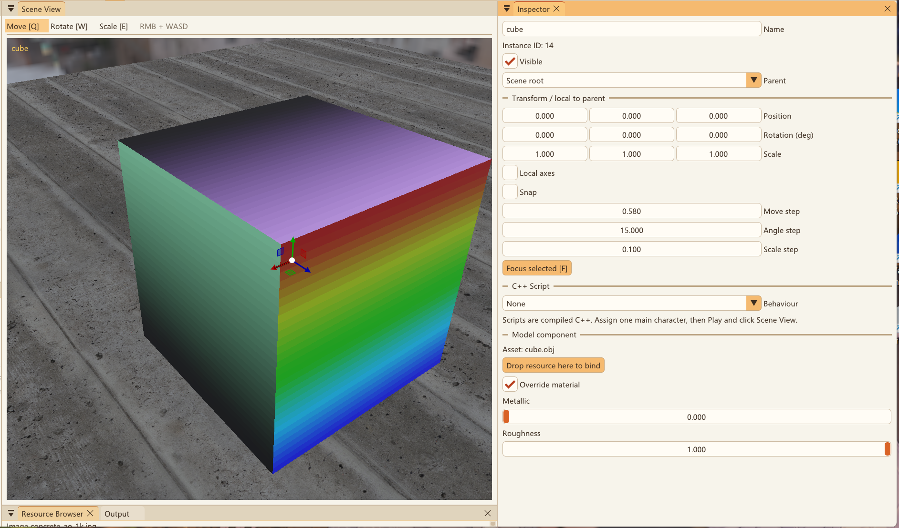
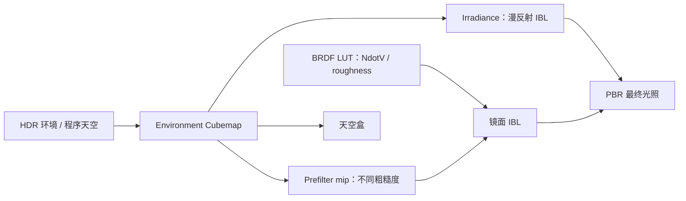
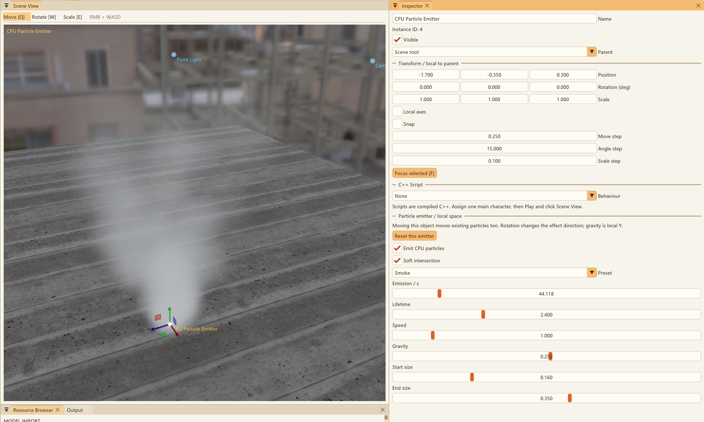

# Lancelot Engine 项目完整说明

[中文 README](../README.md) · [English README](../README.en.md) · [截图与复现](SCREENSHOTS.md)

本文按当前代码的职责解释项目，而不是按旧的开发轮次排列。
历史上的“渲染六阶段”和“架构四阶段”是两套计划，不能用同一个阶段编号表示整体完成度。

## 1. 当前定位与模块

项目是 Windows / C++20 / OpenGL 3.3 的教学型引擎与编辑器原型。
编辑器入口为 `editor/src/EditorMain.cpp`；`src/main.cpp` 仅保留早期练习。

| 模块 | 负责什么 | 不负责什么 |
| --- | --- | --- |
| Project | 打开/新建项目，场景和资源引用读写 | 动态编译脚本、自动复制/打包外部资源 |
| Scene | 对象 ID、局部 TRS、父子关系、组件设置与世界矩阵 | 直接提交 OpenGL 绘制 |
| AssetLibrary | 多模型导入、路径引用与 GPU 资源缓存 | 文件移动追踪、自动热重载、全局 GUID 资产系统 |
| RuntimeSession | Play 副本、脚本生命周期、暂停和单步 | 通用物理引擎、脚本崩溃隔离 |
| SimulationRuntime | 按对象 ID 管理粒子、水、烟雾与蒙皮运行实例 | 持久化某一帧的模拟状态 |
| Renderer | 阴影、颜色、透明、HDR 后处理与统计 | 推进粒子、流体或动画时间 |
| EditorWorkspace / Panels | Docking、选择、Gizmo、参数、资源和历史记录 | 任意可插拔编辑器模块 |
| LancelotPlayer | 无 ImGui 的独立运行宿主 | 项目编辑或运行变化回写 |

引擎使用浅继承区分对象类别，使用组合保存设置。它不是完整 ECS。
详细类型树和项目格式见 [引擎与项目](ENGINE_PROJECTS.md)，职责边界见 [架构说明](ARCHITECTURE.md)。

## 2. 从项目到一帧画面



静态几何通常在导入时上传；每帧更新的主要是矩阵、uniform、实例数据或模拟缓冲。
每帧仍会提交绘制命令，并不是调用一次 GPU 后就永久自动绘制同一场景。
更新与绘制分离允许暂停后继续渲染，也允许对同一更新结果重复绘制。

## 3. 顶点、缓冲与变换

主静态模型使用交错顶点布局：

```text
location 0: position.xyz
location 1: uv.xy
location 2: normal.xyz
location 3: tangent.xyz + handedness
location 4–7: 实例 model matrix 的四列
```

- VBO 保存顶点数据；EBO 保存顶点索引，不是哈希表。
- VAO 记录如何从缓冲中读取属性及其布局，并关联索引缓冲。
- 同一 Mesh 的多个实例可以共享几何，不必为每个顶点重建 VAO/VBO。
- stride、offset、属性类型或绑定错误会造成几何错乱；布局必须与 Shader 输入一致。
- UV 的两个分量表示纹理二维坐标；它们不是两张纹理，也不是世界 XYZ。
- 纹理单元是 Shader 采样器绑定资源的槽位，不是一个像素的纹理层数。

当前对象的模型矩阵关系：

```text
LocalTRS = T × Rz × Ry × Rx × S
Model = ParentWorld × LocalTRS × ImportTransform
ClipPosition = Projection × View × Model × LocalPosition
```

ImportTransform 处理模型导入时的居中与归一化，编辑 TRS 控制对象摆放。
Gizmo 使用对象的编辑坐标系；并非已经支持任意自定义 Pivot 系统。
父节点下的世界编辑会转换回局部值；无法用 TRS 表示的剪切会被拒绝。

对于非均匀缩放，世界法线应使用线性变换部分的逆转置：

$$
N_{world}=\operatorname{normalize}\left((M_{3\times3}^{-1})^T N_{local}\right)
$$

法线随几何变换保持垂直关系，不是先移动法线再据此重建物体。
法线贴图通过 TBN 修改像素的光照方向，不改变网格轮廓。

## 4. PBR、环境光与后处理





截图分别为 `Metallic=1, Roughness=0.05` 和 `Metallic=0, Roughness=1`。
这里同时改变了两个变量；单变量实验方法见 [截图说明](SCREENSHOTS.md)。

直接光使用 Cook–Torrance 微表面模型，概念式为：

$$
f_r = k_D\frac{c}{\pi}
    + \frac{D_{GGX}\,G_{Smith}\,F_{Schlick}}
    {4(N\cdot V)(N\cdot L)}
$$

Shader 会对点积和分母做数值保护。Metallic 影响漫反射/镜面响应，
Roughness 控制微表面分布与环境预过滤层级，不能简单等同于“亮度”。



环境预计算在初始化时执行，正常帧进行纹理采样。
地面使用外部 Albedo / Normal / Roughness / AO 贴图组；
OBJ 路径有材质颜色、颜色贴图及标量覆盖，并保留演示法线回退。
静态 glTF 则读取核心 PBR 贴图与参数，不能据此宣称所有格式拥有同等材质支持。

渲染链路概览：

```text
阴影深度 Pass
→ 不透明模型 / 平台 / 静态 glTF / 蒙皮
→ PBR 直接光 + IBL、天空盒、透明 Primitive
→ 水面或调试几何、烟雾与特效粒子
→ HDR 亮区提取、Ping-Pong 高斯模糊
→ Bloom 合成、曝光 Tone Mapping、Gamma、可选灰度
→ Scene View 纹理 / Player 窗口
```

水面折射与软粒子采样独立的场景颜色/深度副本，避免同一附件同时读写。
主 OBJ/平台路径支持最多 8 个点光源和 4 个聚光灯，但每类只有第一个生成阴影；
glTF、蒙皮和水的光照路径仍有差异，蒙皮尚无完整阴影支持。
视锥剔除使用包围球，不是遮挡剔除。Profiler 的绘制统计包含多 Pass 重复提交，
不包含编辑器自身绘制；截图 FPS 不能用来推断一般性能。

## 5. 资产与动画

模型导入保留多材质批次，路径引用允许多个模型同时驻留。
OBJ 使用 tinyobjloader，glTF / GLB 使用 tinygltf，其余已启用的模型格式使用 Assimp。
Assimp 静态导入烘焙节点变换；不会把每个节点自动拆成可独立编辑的对象。
FBX 等骨骼资产当前显示静态姿态，动画请使用支持的 glTF / GLB 蒙皮路径。
完整格式表、媒体编码边界见 [资产格式](ASSET_FORMATS.md)。

静态 glTF 支持三角形 Primitive、多个节点/材质、Base Color、Metallic/Roughness、
Normal、Occlusion、Emissive，以及 OPAQUE / MASK / BLEND 和双面材质。
Metallic-Roughness 图的 G 为 Roughness、B 为 Metallic；AO 取 R。
复杂扩展、压缩数据、Morph Target 和多 Skin 不属于完整支持范围。

蒙皮路径在 CPU 上采样动画和更新关节层级，在 GPU 上混合顶点影响：

```text
BoneMatrix = inverse(MeshGlobal) × JointGlobal × InverseBindMatrix
SkinnedPosition = Σ weight[i] × BoneMatrix[joint[i]] × LocalPosition
```

支持片段切换渐变和 LINEAR / STEP / CUBICSPLINE 采样，
但仍只处理一个蒙皮 Primitive，不是任意复杂角色的通用动画运行时。
静态顶点不会因为骨骼动画而每帧由 CPU 重写全部 VBO。

## 6. 三种烟雾/流体概念

| 系统 | 保存的数据 | 显示方式 | 主要限制 |
| --- | --- | --- | --- |
| CPU / GPU 特效粒子 | 位置、速度、年龄等粒子状态 | 面向相机的 Billboard | CPU 局部排序；GPU 加法混合 |
| 二维 Fluid2D | 速度、密度、压力、散度、障碍纹理 | 实验画布和可变换烟雾平面 | 固定 192×192，非三维体积 |
| 三维 FluidSystem | SPH 水粒子、标量场、表面网格 | 连续水面 / 点 / 线框 | 最多 256 粒子，简化物理与局部容器边界 |

### 粒子



CPU 系统支持 Sparks / Smoke / Snow，最多 4096 粒子；
更新生命周期、速度和重力，实例化 Billboard 绘制，支持深度排序与软交界。
GPU 系统用 Transform Feedback 更新两份交换角色的 Buffer，默认 8192 槽位、
最多 32768；无需 Compute Shader，但不进行透明粒子排序。

每个发射器有独立参数与运行状态。粒子在局部空间模拟，变换发射器会影响已有粒子，
局部重力也随旋转变化；复制配置会创建新的模拟状态，不复制现存粒子。

### 二维烟雾

```text
速度 / 密度平流 → 注入 → 散度
→ Jacobi 压力求解 → 减去压力梯度 → 显示密度
```

2D Smoke Lab 支持注入、绘制障碍、暂停、重置及中间场查看。
这是简化的平流/压力投影实验，尚无温度、浮力、涡量约束或体积光线步进。

### 三维水体


```text
粒子邻域 → 密度 / 压力 → 压力力 / 黏性 / 重力 / 容器边界
→ 固定步更新 → 三维标量场 → marching tetrahedra → 连续表面
→ 屏幕空间折射 / 吸收 / Fresnel 环境反射 / 边缘泡沫近似
```

Water Lab 提供倒水、Splash、暂停、单步、网格重建频率与材质控制。
默认设置为 125 粒子，按实例可见性与暂停设置决定模拟；
不要假设用户保存后的场景与默认 Sandbox 开关相同。
水盆边界随对象变换，但尚不与任意模型/平台进行物理碰撞。
折射只能采样屏幕已有内容，不是光线追踪折射；没有表面张力、GPU SPH 或三维烟火。

## 7. 编辑、保存与运行

新建/打开项目使用系统文件与目录窗口，步骤见 [项目说明](ENGINE_PROJECTS.md)。
所有场景类别纳入层级与属性编辑，粒子是“发射器对象”，不是逐粒子独立编辑。
Q / W / E、层级、复制删除与 64 步历史记录见 [编辑工作流](EDITOR_WORKFLOW.md)。

Play 深复制作者场景，运行脚本和模拟；Pause 保持渲染、停止更新；
Step 推进 1/60 秒并保持暂停；Stop 丢弃副本并还原编辑相机。
绑定编译式 C++ 脚本的方法见 [运行模式](PLAY_MODE.md)。

Ctrl+S 保存作者数据与资源引用，保留 .bak；每个文件单独替换，
不是描述文件与场景文件的跨文件事务。模拟点、烟雾纹理、障碍笔刷和时间不保存。
资源不自动复制，删除对象不删除磁盘资产，脚本与资源没有热重载。

## 8. 构建、检查与下一步学习

构建命令、环境要求与测试入口统一见 [README 快速开始](../README.md#快速开始)。
常见“文件存在但找不到”应检查实际项目、assetRoot、相对路径和依赖文件，
而不是把所有项目的资源都混放到引擎目录。

建议用当前项目按以下顺序做可验证的小实验：

1. VAO/VBO/EBO 与顶点属性：对应 Mesh 布局，观察 stride / offset 的关系。
2. TRS、父子矩阵、相机与法线：用 Gizmo 和 Inspector 对照世界/局部坐标。
3. PBR / IBL：一次只改 Metallic 或 Roughness，再单独改变环境与曝光。
4. 阴影与 HDR：查看深度图，关闭 Bloom 对比，分清光照与后处理。
5. CPU 与 GPU 粒子：理解局部模拟、生命周期、透明混合和双缓冲。
6. 二维流体：逐个查看速度、压力、散度和障碍，不只观察最终烟雾。
7. SPH 与水面：切换点/线框/表面，区分模拟、表面重建与材质显示。
8. 引擎工程：阅读项目读写、资源缓存、更新/绘制边界与运行副本。

后续优先统一资产与光照路径、完善诊断、蒙皮阴影和资源工作流，
再扩展 GPU 流体、体积效果、自动打包与更通用的编辑器。
